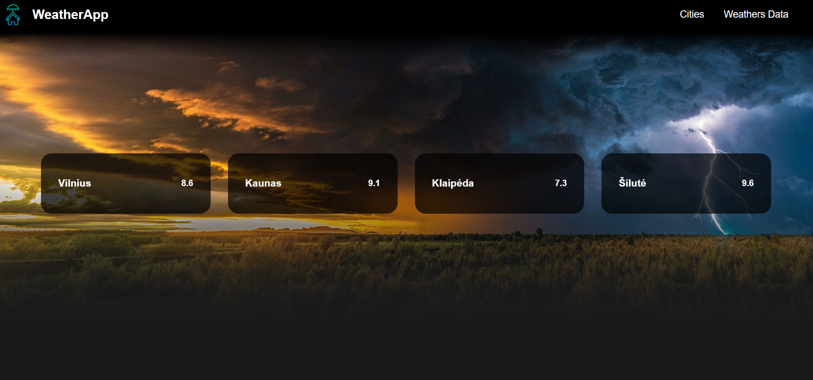
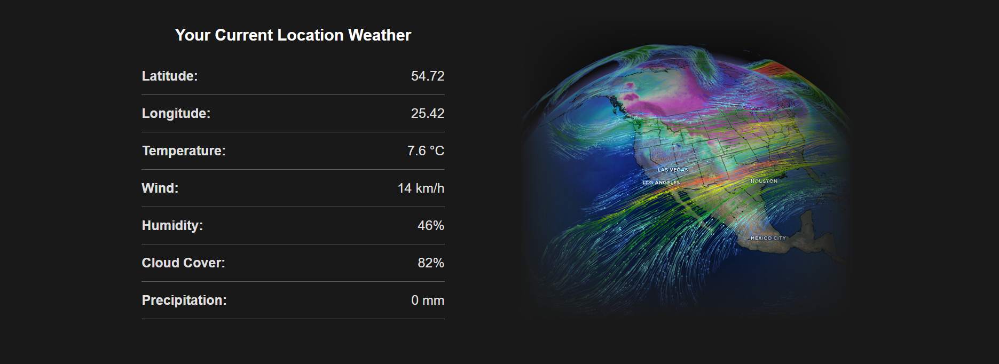
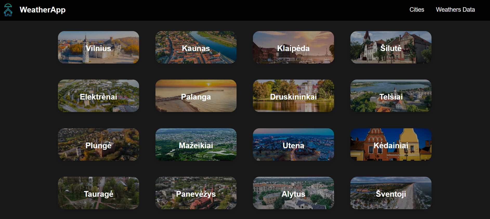
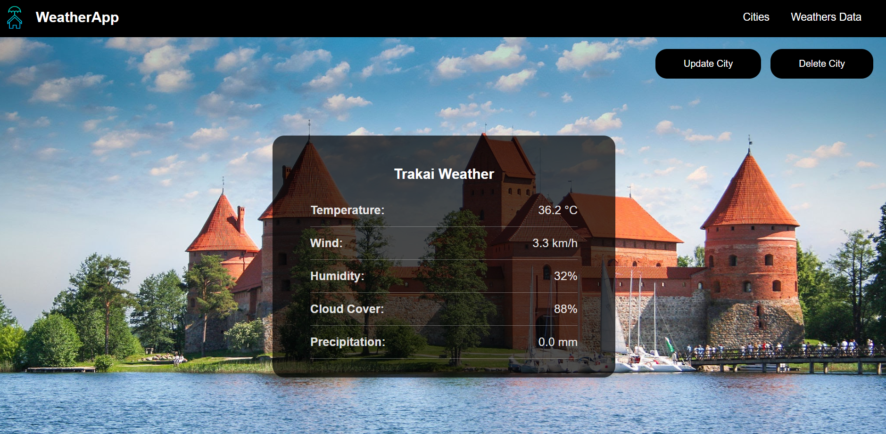

# WeatherApp

WeatherApp is a simple Django-based web application that allows users to get real-time weather information for any city in using the OpenWeather API.

This application allows users to add, update, and delete cities using Django function-based views that handle HTTP GET and POST methods. All weather records are stored in the "Weathers Data" table for tracking historical data.

## A few visual snippets from the website

## Homepage:
  



## Cities existing in database:


## Selected city weather:


## Tech Stack
- Python
- Django
- HTML/CSS
- JavaScript
- OpenWeather API

## Project Structure

```dash
weatherapp/
├── manage.py                   # Django command-line utility for administrative tasks
├── requirements.txt            # List of required Python packages
├── db.sqlite3                  # SQLite database file
│
├── project/                    # Django main project configuration
│   ├── __init__.py             # Marks this directory as a Python package
│   ├── asgi.py                 # ASGI config for asynchronous server support
│   ├── settings.py             # Main settings/configuration for the project
│   ├── urls.py                 # Root URL configurations
│   ├── views.py                # Project-level views
│   └── wsgi.py                 # WSGI config for deploying on WSGI-compatible servers
│
├── static/                     # Global static files (CSS, JS, images)
│   ├── images/                 # All page images (images, backgrounds, etc.)
│   ├── script/
│   │     └── script.js         # JavaScript functionality
│   └── styles/
│         └── style.css         # Global styling for the project
│
├── templates/                  # Global templates directory
│   ├── .vscode/
│   │     └── settings.json     # VSCode-specific project settings
│   ├── home.html               # Home page template
│   ├── main.html               # Main layout structure template
│   └── navbar.html             # Navigation bar template
│
├── weathers/                   # Django application
│   ├── __init__.py             # Marks this directory as a Python package
│   ├── admin.py                # Admin interface configurations
│   ├── apps.py                 # Application-specific configurations
│   ├── models.py               # Django models for weather data and cities
│   ├── views.py                # Core logic for handling weather-related views
│   ├── urls.py                 # URL routes specific to the weather app
│   ├── templates/
│   │     └── weathers/
│   │          ├── add_city.html        # Form template to add a new city
│   │          ├── cities.html          # View displaying list of all cities
│   │          ├── city.html            # Detail view for a single city
│   │          ├── update_city.html     # Template for editing a city's data
│   │          └── weathers_data.html   # Displays weather data along with temperature and timestamp of when the city was last viewed
│   └── helper_functions/               
│         ├── __init__.py               # Marks this directory as a Python package
│         └── weathers.py               # Helper functions for weather processing/API calls
```

---

## Getting Started

Follow these steps to run the project locally:

### 1. Clone the Repository

```bash
git clone https://github.com/AurelijaBu/Django_WeatherApp.git
cd Django_WeatherApp
```

### 2. Create a Virtual Environment

```bash
python -m venv venv
```

### 3. Activate the Virtual Environment
- Windows:
```bash
venv\Scripts\activate
```
-Mac/Linux:
```bash
source venv/bin/activate
```

### 4. Install Dependencies
```bash
pip install -r requirements.txt
```

### 5. Run Migrations
```bash
python manage.py migrate
```

### 6. Start the Server
```bash
python manage.py runserver
```

Open your browser and go to:
```bash http://127.0.0.1:8000/```
